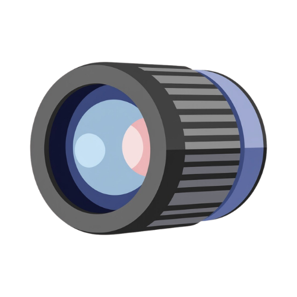
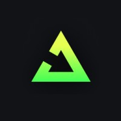
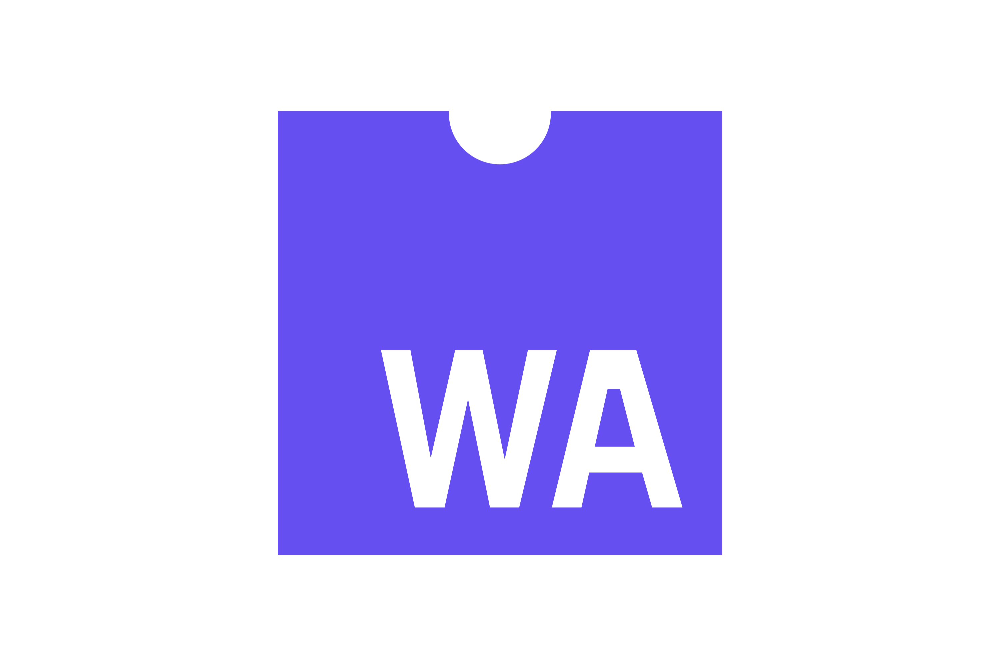
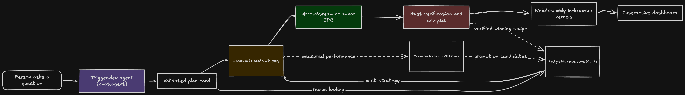
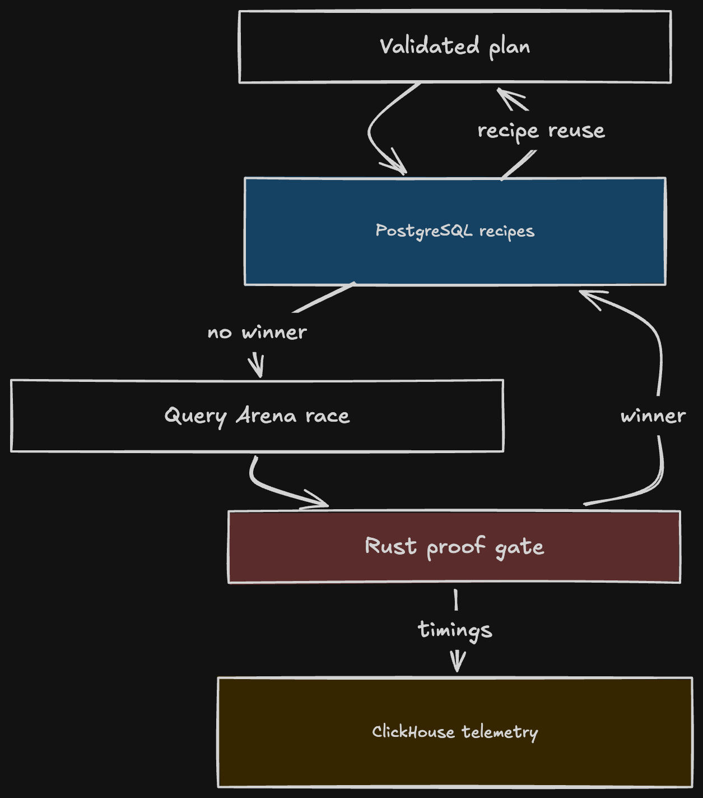

<p align="center">
  
</p>

<h1 align="center">Lens</h1>

<p align="center">
  Ask a question. Explore millions of rows. Receive an interactive dashboard.
</p>

<p align="center">
  
  &nbsp;&nbsp;&nbsp;
  
  &nbsp;&nbsp;&nbsp;
  
  &nbsp;&nbsp;&nbsp;
  
  &nbsp;&nbsp;&nbsp;
  
</p>

## Meet Lens

Most data tools give you a query box or a collection of charts. Lens starts with
the question you actually care about.

Every connected table is described through the same analytical contract: a
time field, measurable values, dimensions, formats, and supported operations.
Once that contract is validated, the agent can plan trends, comparisons,
rankings, distributions, composition, correlations, and anomaly detection
without product code written for that table.

Lens turns the validated plan into a living dashboard. The answer can be
scrubbed through time, focused on a category or place, opened into a deeper
view, and recomputed locally when the question calls for raw exploration.

## From question to dashboard

An OpenAI agent turns the question into a validated analysis plan. PostgreSQL
is checked for a proven query recipe. ClickHouse scans and aggregates the
source data. Arrow carries the result as compact columnar buffers. Rust checks
or reshapes those columns, both on the server and inside the browser through
WebAssembly. Trigger.dev coordinates the durable work behind the answer.

The natural language is never sent directly to the database. It first becomes
a typed plan. A concrete plan can look like this:

```json
{
  "version": 1,
  "dataset": "uk_price_paid",
  "datasetVersion": 1,
  "title": "Manchester average sale price by year",
  "explanation": "Average recorded sale price in Manchester from 2015 through 2023.",
  "operation": "trend",
  "metric": {
    "kind": "measure",
    "measure": "price",
    "aggregation": "average"
  },
  "interval": "year",
  "splitBy": null,
  "filters": {
    "timeRange": {
      "from": "2015-01-01",
      "to": "2023-12-31"
    },
    "dimensions": [
      {
        "dimension": "town",
        "values": ["Manchester"]
      }
    ],
    "measures": []
  }
}
```

Zod validates the plan against the selected data source manifest. The query
compiler can therefore use only registered columns, operations, and filters.
The same contract also tells the interface which visual building blocks and
interactions make sense.

The result is not a text response with a chart attached. It is a dashboard
whose layout and interactions reflect the question.

<p align="center">
  <a href="docs/diagrams/agent-dashboard.png">
    
  </a>
</p>

<p align="center"><em>One question becomes a verified, interactive dashboard while its measured execution teaches the next answer.</em></p>

## The Query Arena

Query Arena turns every supported answer into evidence for the next one.

First, Lens separates the identity of a question into two parts. The execution
signature is tied to one data source version and its physical column roles. It
is safe to reuse directly after verification. The semantic family describes
only the analytical shape:

```json
{
  "shape": "time_series",
  "operation": "trend",
  "metric": {
    "kind": "measure",
    "aggregation": "average"
  },
  "interval": "month",
  "transform": "value",
  "grouping": {
    "dimensions": 1,
    "cardinality": "unknown"
  },
  "filters": {
    "timeRange": "historical",
    "dimensions": [],
    "measures": []
  }
}
```

That family contains no table name, column name, category value, or prose from
the user. “Show hourly average response time by service for the last month” and
“show hourly average energy use by building for the last month” can belong to
the same family. The second data source can use the first race as a prior about
which strategy to try first, but it cannot inherit the winner blindly.

The complete loop has five steps:

1. Lens asks PostgreSQL whether the exact execution signature already has a
   verified recipe.
2. If there is no exact winner, semantic family history can order the
   candidates without authorizing one.
3. Trigger.dev runs alternating measured passes with the ClickHouse query cache
   disabled.
4. Rust fingerprints the Arrow schema and every value. A candidate is eligible
   only when its result is exactly equivalent to the baseline.
5. ClickHouse stores every trial as telemetry and PostgreSQL activates the
   verified winner for sibling questions on that data source version.

A new question with different literal filters can now take the learned path
immediately. A matching shape on another data source starts with better
evidence, reraces locally, and earns its own recipe. This is cross conversation
learning without sharing unsafe physical assumptions.

The Performance view makes that process visible as it happens. Each measured
pass moves through its lane, Rust becomes the proof checkpoint, and the winner
moves into the recipe registry. A live System Intelligence panel then queries
Lens its own telemetry to show verified races, recipe reuse, learned question
families, and the change in tail latency across the deployment.

Repeated demand can also become a guarded storage proposal. Lens inspects the
evidence and can recommend an allowlisted ClickHouse projection with an
estimated speed and storage effect. A person must approve the proposal.
Trigger.dev revalidates it before any DDL is allowed to run, records the
decision in PostgreSQL, and rolls the change back if materialization fails.
Physical changes are disabled by default.

<p align="left">
  <a href="docs/diagrams/query-arena.png">
    
  </a>
</p>

<p align="left"><em>The Query Arena learns only from strategies that pass exact Rust verification.</em></p>

## Why Arrow and Rust matter

Traditional analytics applications often turn every row into JSON, allocate a
JavaScript object for it, and then rebuild the same information for a chart.
Lens keeps the result columnar.

For the property exploration test, ClickHouse returned every recorded sale
from 2022 with price, property type, tenure, and new build status. Rust turned
those columns into a local exploration index that can update distributions,
percentiles, and density views without another network request.

The benchmark alternates the same ClickHouse query between `ArrowStream` and
`JSONEachRow` for three trials and reports the median.

| Measurement | Arrow IPC with Rust | JSONEachRow |
| :--- | ---: | ---: |
| Transactions | 993,644 | 993,644 |
| Payload received by the application | 4.73 MB | 80.17 MB |
| ClickHouse to client round trip | 499 ms | 2,082 ms |
| Local work | 36.2 ms to build the index | 242.7 ms to parse JSON |
| Interactive local index | 8.43 MB | Not built |

The Arrow representation was **16.9× smaller** at the application boundary and
completed the round trip **4.2× faster**. Rust built the complete interactive
index **6.7× faster** than JavaScript parsed the JSON objects alone.

This comparison is intentionally transparent. HTTP compression narrows the
estimated transfer difference to 1.13× because JSON compresses well. The JSON
measurement also stops after parsing. It does not build an equivalent index
for filtering, histograms, percentiles, and density calculations.

You can reproduce it against the configured ClickHouse service.

```bash
pnpm benchmark:formats
```

## The technology behind Lens

<p>
  
</p>

ClickHouse handles the high volume analytical scans, aggregations, Arrow output,
and performance history.

<p>
  
</p>

Trigger.dev coordinates agent work, data source registration, and the durable
Query Arena races. It also owns the approval gated storage tuning job so that a
long ClickHouse materialization can be observed, retried, and audited.

<p>
  
  &nbsp;&nbsp;
  
</p>

Rust provides exact Arrow verification and high performance analysis kernels.
WebAssembly brings the same engine into the browser for instant local
exploration.

<p>
  
</p>

PostgreSQL stores the current operational state, registered data sources, and
the verified recipe selected for each analysis signature. It also records
semantic family lineage and every storage proposal decision.

## How Lens uses ClickHouse and Trigger.dev

ClickHouse and Trigger.dev are not badges attached to Lens. Their platform
features shape the way an answer is planned, executed, verified, learned from,
and presented.

### ClickHouse

| Platform feature | How Lens uses it | See it in the project |
| :--- | :--- | :--- |
| [Official JavaScript client](https://clickhouse.com/docs/integrations/javascript) | A shared typed client runs analytical queries, streams results, inserts performance telemetry, and executes guarded physical changes. | [client.ts](apps/web/lib/clickhouse/client.ts) |
| [ArrowStream](https://clickhouse.com/docs/interfaces/formats/ArrowStream) | Results arrive as LZ4 compressed Arrow record batches. Rust reads the typed columns directly, avoiding the usual ClickHouse to JSON to JavaScript object conversion. The same representation powers server verification and browser analysis through WebAssembly. | [arrow-stream.ts](apps/web/lib/clickhouse/arrow-stream.ts) |
| [PREWHERE](https://clickhouse.com/docs/sql-reference/statements/select/prewhere) | Query Arena races a normal scan against an early filtering strategy over repeated passes with the query cache disabled. A strategy can win only after Rust proves that its Arrow result is exactly equivalent. | [query-arena.ts](apps/web/src/trigger/query-arena.ts) |
| [Projections](https://clickhouse.com/docs/data-modeling/projections) | Repeated measured demand can produce a deterministic, allowlisted projection proposal. A person approves it, Trigger.dev materializes it, failures are rolled back, and Lens queues a new race to measure the result. | [projection.ts](apps/web/lib/query-arena/tuning/projection.ts) |
| [MergeTree](https://clickhouse.com/docs/engines/table-engines/mergetree-family/mergetree) telemetry | Every verified race becomes analytical data. Lens queries its own history to show recipe reuse, learned semantic families, and latency movement in the System Intelligence view. | [intelligence.ts](apps/web/lib/query-arena/intelligence.ts) |

### Trigger.dev

| Platform feature | How Lens uses it | See it in the project |
| :--- | :--- | :--- |
| [AI agents](https://trigger.dev/docs/ai-chat/overview) | The conversational analyst runs as a durable agent with a pinned data source, validated tools, and resumable session state. A refresh or long analysis does not have to break the conversation. | [property-agent.ts](apps/web/src/trigger/property-agent.ts) |
| [Schema tasks](https://trigger.dev/docs/tasks/schemaTask) | Zod schemas validate the boundaries of data source registration, performance races, and physical tuning jobs before work begins. | [register-data-source.ts](apps/web/src/trigger/register-data-source.ts) |
| [Run metadata](https://trigger.dev/docs/runs/metadata) and [Realtime](https://trigger.dev/docs/realtime/overview) | Tasks publish phases, progress, timings, and race trials while they run. The application subscribes to those runs and turns the events into the live performance canvas instead of hiding the work behind a spinner. | [events route](apps/web/app/api/query-arena/%5BrunId%5D/events/route.ts) |
| [Idempotency](https://trigger.dev/docs/idempotency) and [tags](https://trigger.dev/docs/tags) | Stable keys prevent duplicate races and tuning work during retries. Tags preserve the relationship between an answer, analysis shape, data source, race, and storage proposal. | [query-arena.ts](apps/web/src/trigger/query-arena.ts) |
| [Durable tasks](https://trigger.dev/docs/tasks/overview) | Projection materialization is modeled as observable background work with a human approval gate, validation immediately before execution, recorded decisions, rollback on failure, and a measured rerace afterward. | [physical-tuning.ts](apps/web/src/trigger/physical-tuning.ts) |

These official references were also the implementation guide for Lens. The
links above connect each platform capability to the exact code path where it is
used.

## Run Lens with one command

Lens uses ClickHouse Cloud and Trigger.dev Cloud while keeping the application
and its operational PostgreSQL database local. Docker Compose builds the web
application, starts PostgreSQL, applies both database migration sets, and starts
the Trigger.dev development worker.

You need Docker Compose 2.20 or newer, a ClickHouse service, an OpenAI API key,
and a Trigger.dev project.

Copy the environment template:

```bash
cp apps/web/.env.example apps/web/.env.local
```

Fill in these values:

| Variable | Purpose |
| :--- | :--- |
| `CLICKHOUSE_HOST`, `CLICKHOUSE_USER`, `CLICKHOUSE_PASSWORD`, `CLICKHOUSE_DATABASE` | Connect the application and migration job to ClickHouse |
| `OPENAI_API_KEY`, `OPENAI_MODEL` | Run the analysis agent |
| `TRIGGER_SECRET_KEY` | Let the web application start tasks and inspect runs |
| `TRIGGER_ACCESS_TOKEN` | Authenticate the headless Trigger.dev worker |
| `TRIGGER_PROJECT_REF` | Select the Trigger.dev project containing the tasks |
| `DATA_SOURCE_ADMIN_TOKEN` | Protect private source discovery and registration |

Choose a nonempty `DATA_SOURCE_ADMIN_TOKEN`. The production interface asks for
that same value before it reveals private tables or allows data source changes.

The ClickHouse user needs permission to create and alter the Query Arena
telemetry table. Keep `LENS_TUNING_EXECUTION_ENABLED=false` unless you
intentionally want approved physical tuning proposals to execute. When tuning
is enabled, `LENS_TUNABLE_DATA_SOURCES` must contain the exact allowed source
and table.

Start the complete stack:

```bash
docker compose up --build
```

## Verify the project

```bash
pnpm verify
```

## License

Lens is available under the Apache License 2.0. See [LICENSE](LICENSE).
